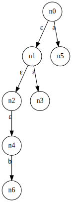

！！！The project has stopped development and maintenance.  
=== 
# Compilers
编译原理练习

## 一、基础算法

### NFA 转 DFA

**子集构造算法** 

**a.ε-闭包(ε-closure) 的计算**

`EpsilonClosure(node)` 即搜索所有 `node` 节点所有与之 `ε` 转换的节点。如下图所示，与 `n0` 有 `ε` 转换的节点有 `n1,n2,n3,n4`。则 `EpsilonClosure(n0)` 返回集合 `{n0,n1,n2,n3,n4}`。  

  

```
/* ε-closure: 基于深度优先遍历的算法伪代码 */
EpsilonClosure(node)
{
    set epsilon_closure = {};  // 初始化一个空集合，用来存放所有闭包节点
    EpsilonClosureDFS(node);  // 使用 DFS 遍历
}

EpsilonClosureDFS(node)
{
    epsilon_closure += {node};  // 将节点添加到闭包集合中
    set node_list = {node->ε};  // 与 node 通过ε转换的邻节点集合 
    foreach(next_node in node_list)
    {
        if (!Visited(next_node))  // 如果 next_node 没有访问过
            EpsilonClosureDFS(next_node);
    }
}
```

**b. 工作表算法**

这个阶段主要是不断调用之前写好的闭包计算方法。首先进入的是起始节点，对起始节点求闭包则得到的是新生成的 DFA 的起始节点。接下来是用一个工作表模拟一个广度优先搜索，不断地从边缘拓展得到新节点，直到工作表为空。  

```
WorkList(start_node)
{
    EpsilonClosure(start_node);
   q0 = epsilon_closure;  // DFA 的起始节点，q0 是 start_node 的闭包计算得到集合

    Q += {q0};  // Q 用来标记 q0 是否访问过，如果已访问过则不需要再进入工作表

    worklist.push_back(q0);  // 将 q0 放进工作表

    while (!worklist.empty())  // 当工作表不为空
    {
        q = worklist.front(); // 取工作表第一个元素的值
        worklist.pop_front();  // 将工作表第一个元素移出

        foreach (c in character)  // character 是每转换字符集合
        {
            t = EClosure(Delta(q, c));  // Delta 求 q 集合里每一个元素经过 c 转换得到的节点集合。EClosure 求集合中每一个元素的闭包结果，并把结果放在一个集合中
            if (t.size() == 0)  // 如果新生成的集合为空则开始新一轮迭代
                continue;

            // 并上 t 集合
            DFA[(q, c)] += t;  // t 是 q 经过 c 转换得到的集合，所以要并上

            if (t not in Q)  // 如果 t 没有出现在 Q 中
            {
                Q += {t}
                worklist.push_back(t);
            }
        }
    }
}
```

**C++ 实现**
GitHub: https://github.com/InspAlgo/Compilers/tree/master/src/NFA2DFA   

**参考**

+   华保建，网易公开课《编译原理》，NFA转换成DFA：子集构造算法  

